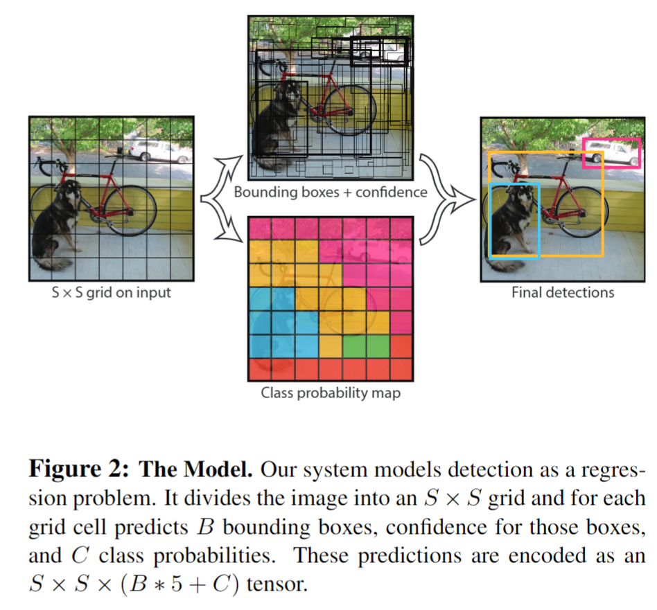
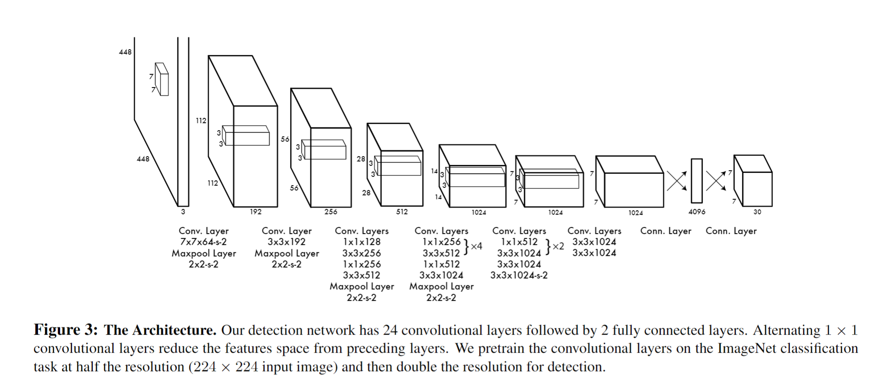

<!--
 * @Author       : JonnyZhang 71881972+jonnyzhang02@users.noreply.github.com
 * @LastEditTime : 2023-09-11 22:12
 * @FilePath     : \SummerSchool\README.md
 * 
 * coded by ZhangYang@BUPT, my email is zhangynag0207@bupt.edu.cn
-->
# Task 1

## 目标检测的一般流程

目标检测是计算机视觉领域的关键任务，旨在从图像或视频中准确地定位和识别出不同类别的目标物体。其一般流程包括以下步骤：

1. 数据收集和预处理：收集包含目标物体的图像或视频数据，并进行预处理操作，如图像缩放、裁剪和色彩空间转换，以确保数据的一致性和适应性。

2. 特征提取：使用计算机视觉技术从输入图像中提取有意义的特征。常用的特征提取方法包括基于手工设计的特征（如Haar特征、HOG特征）和基于深度学习的特征（如卷积神经网络中的卷积层输出）。

3. 候选区域生成：在图像中生成一组**候选目标区域**，这些区域可能包含目标物体。候选区域生成方法可以是基于滑动窗口的方法，也可以是基于区域提议的方法（如Selective Search、EdgeBoxes等）。

4. 目标分类：对每个候选区域进行目标类别的分类。这一步骤可以使用机器学习算法（如支持向量机、随机森林等）或深度学习算法（如卷积神经网络）进行目标分类。

5. 边界框回归：对于分类为目标的候选区域，进一步精细调整其位置和大小，以更准确地框定目标的边界框。这一步骤通常使用回归模型来预测边界框的坐标偏移量。

6. 后处理：根据一些规则和策略对检测结果进行后处理，包括去除重叠的边界框、筛选置信度较低的检测结果等。

7. 输出结果：输出目标检测的结果，通常以边界框的形式给出，包括目标的类别标签、位置和置信度等信息。

## 论文阅读

### 三步法读论文

第一遍：读标题和摘要，然后跳转到结论，可以同时看关键的图和表。约十几分钟。

第二遍：对整个文章过一遍，知道每一个部分在干什么。这时不需要过分追究证明或算法细节。可以圈出来不懂的地方。

第三遍：解决问题，包括证明和算法细节。这时可以结合第二遍的笔记，对不懂的地方进行补充。

### YOLOv1

[You Only Look Once: Unified, Real-Time Object Detection](./yolo.pdf)

#### Pass 1

**标题**：

- You Only Look Once: Unified, Real-Time Object Detection

所谓Unified，是指YOLO是一个统一的网络，可以直接从完整图像中预测边界框和类概率。

**摘要翻译**：

我们提出了一种全新的物体检测方法 `YOLO`。 之前的物体检测工作是利用**分类器**来进行检测。而我们将物体检测作为一个**回归问题**，回归到空间上分离的边界框和相关的类别概率。在一次评估中，单个神经网络可直接从完整图像中预测边界框和类概率。由于整个检测管道是一个**单一的网络**，因此可以直接根据检测性能进行**端到端**的优化。

我们的统一架构速度极快。我们的基本 YOLO 模型以每秒 45 帧的速度实时处理图像。该网络的缩小版--Fast YOLO--处理速度达到惊人的每秒 155 帧，而 mAP 仍是其他实时检测器的两倍。与最先进的检测系统相比，YOLO 的定位错误更多，但在**背景上预测误报**的可能性较小。最后，YOLO 可以学习非常通用的物体表征。当从自然图像**泛化**到艺术品等其他领域时，它的表现优于其他检测方法，包括 DPM 和 R-CNN

从以上摘要中可以看出，YOLO的特点是：

1. **回归方法**：YOLO将目标检测视为回归问题，通过预测边界框的位置和相关类别的概率，实现目标的准确定位和分类。

2. **统一架构**：YOLO采用单一的神经网络，可以直接从完整图像中一次性预测出边界框和类别概率，实现端到端的优化，提高检测性能。

3. **高速实时处理**：YOLO的基础模型可以以每秒45帧的速度实时处理图像，而较小版本的Fast YOLO则以每秒155帧的速度处理图像，仍能保持较高的准确率。

4. **低背景误报**：相比其他实时检测器，YOLO在预测背景误报方面更少，减少了错误报告非目标物体的情况。

5. **通用目标表示**：YOLO能够学习到非常通用的目标表示，它在从自然图像到艺术品等其他领域的泛化任务中表现优秀。

Conclusion部分依旧重申了上述特点。

#### Pass 2

##### **Introduction**

intro部分主要说YOLO是一种**实时目标检测系统**。与传统的检测方法相比，YOLO采用了全新的方法。它通过在**整个图像上**应用一个**单一的神经网络**，将图像分割成多个区域，并为每个区域预测边界框和概率。YOLO具有以下几个优点：

1. **非常快速**：YOLO的基本网络每秒能处理45帧图像，快速版本的处理速度超过150帧。这意味着可以实时处理流媒体视频，并且延迟少于25毫秒。此外，YOLO的平均精度比其他实时系统高出一倍以上。

2. **全局推理**：YOLO在进行预测时对整个图像进行全局推理。与**滑动窗口和基于区域建议**的方法不同，YOLO在训练和测试时都能看到整个图像，因此它隐含地编码了关于类别及其外观的上下文信息。相比之下，其他方法如Fast R-CNN在图像中将背景错误地识别为对象，因为它无法看到更大的上下文。与Fast R-CNN相比，YOLO的背景错误率减少了一半以上。

3. **学习通用表示**：YOLO能够学习到适用于不同对象的通用表示。在自然图像上训练并在艺术作品上进行测试时，YOLO的性能优于其他顶级检测方法，如DPM和R-CNN。由于YOLO具有很强的泛化能力，当应用于新领域或意外输入时，它不太容易出现故障。

##### **Unified Detection**

系统将输入图像划分为一个 S × S 的网格。**如果一个对象的中心落在一个网格单元中，该网格单元就负责检测该对象。**

每个网格单元预测 **B 个边界框**和相应的**置信度分数**。这些置信度分数反映了**模型对该边界框包含对象的自信程度**，以及它对自己的预测边界框的准确性的估计。形式上，我们定义置信度为 `Pr(Object) * IOUtruthpred`。

**如果该单元格中没有对象存在，则置信度分数应为零。否则，我们希望置信度分数等于预测边界框与实际边界框之间的交并比（IOU）**。

每个边界框由 5 个预测组成：`x、y、w、h 和置信度`。其中` (x, y)` 坐标表示边界框**相对于网格单元边界的中心位置**。宽度和高度**相对于整个图像进行预测**。最后的置信度预测表示**预测边界框**与任何**实际边界框**之间的`IOU`。

每个网格单元还预测 C 个**条件类别概率**，`Pr(Classi|Object)`。这些概率是基于网格单元中是否包含对象的条件的。无论边界框数量 B 如何，我们只为每个网格单元预测一组类别概率。

在测试时，我们将条件类别概率和单个边界框置信度预测相乘，

$$
Pr(Classi|Object) * Pr(Object) * IOU^{truth}_{pred} = Pr(Classi) * IOU^{truth}_{pred} 
$$

这为每个边界框给出了类别特定的**置信度分数**。这些分数既编码了该类别出现在边界框中的概率，也反映了预测边界框与对象的匹配程度。

##### **Network Design**

网络的初始**卷积层从图像中提取特征**，而**全连接层则预测输出的概率和坐标**。

我们的网络架构受到GoogLeNet图像分类模型的启发。我们的网络有24个卷积层，后面跟着2个全连接层。我们不使用GoogLeNet中的inception模块，而是简单地使用1×1的降维层，然后是3×3的卷积层

##### **Train**

我们的最终层可预测类别概率和边界框坐标。我们根据图像的宽度和高度对边界框的宽度和高度进行归一化处理，使其介于 0 和 1 之间。我们将边界框的 x 坐标和 y 坐标参数化为特定网格单元位置的偏移量，使其也介于 0 和 1 之间。

在最后一层使用线性激活函数，所有其他层都使用leakyRELU激活函数：

我们对模型输出的**平方和误差**进行优化。我们使用平方总误差是因为它易于优化，但它与我们最大化平均精度的目标并不完全一致。它将定位误差与分类误差加权相等，这可能并不理想。此外，在每幅图像中，许多网格单元并不包含任何物体。**这使得这些单元格的 "可信度 "分数趋于零，往往会压倒包含物体的单元格的梯度**。这会导致模型的不稳定性，使训练在早期就出现偏离。

为了解决这个问题，我们增加了边界框坐标预测的损失，并减少了不包含物体的边界框信念预测的损失。我们使用两个参数 λcoord 和 λnoobj 来实现这一目标。我们设置 λcoord = 5 和 λnoobj = .5。

**损失函数**：

YOLOv1的损失函数由两个部分组成：边界框损失和类别损失。

1. 边界框损失：

YOLOv1使用平方误差损失（Mean Squared Error，MSE）来度量预测边界框与真实边界框之间的差异。对于每个网格单元（grid cell），如果该网格单元负责检测到一个对象（object），则边界框损失为预测边界框和真实边界框之间的平方误差。如果该网格单元不负责检测到对象，则边界框损失为零。

边界框损失的计算公式如下：

$$
L_{\text{box}} = \sum_{i=0}^{S^2} \sum_{j=0}^{B} \mathbb{1}_{ij}^{obj} \left( (x_i - \hat{x}_i)^2 + (y_i - \hat{y}_i)^2 \right) + \sum_{i=0}^{S^2} \sum_{j=0}^{B} \mathbb{1}_{ij}^{obj} \left( \sqrt{w_i} - \sqrt{\hat{w}_i} \right)^2 + \sum_{i=0}^{S^2} \sum_{j=0}^{B} \mathbb{1}_{ij}^{obj} \left( \sqrt{h_i} - \sqrt{\hat{h}_i} \right)^2
$$

其中：
- S 是每行（列）网格单元的数量。
- B 是每个网格单元预测的边界框数量。
- $(x_i, y_i, w_i, h_i)$ 是第 i 个网格单元预测的边界框的坐标和尺寸。
- $(\hat{x}_i, \hat{y}_i, \hat{w}_i, \hat{h}_i)$ 是实际边界框的坐标和尺寸。
- $\mathbb{1}_{ij}^{obj}$ 是指示函数，如果第 i 个网格单元的第 j 个边界框负责检测到对象，则为 1，否则为 0。

2. 类别损失：

YOLOv1使用交叉熵损失（Cross-Entropy Loss）来度量预测类别和真实类别之间的差异。对于每个网格单元，如果该网格单元负责检测到一个对象，则类别损失为预测类别和真实类别之间的交叉熵损失。如果该网格单元不负责检测到对象，则类别损失为零。

类别损失的计算公式如下：

$$
L_{\text{class}} = \sum_{i=0}^{S^2} \sum_{j=0}^{B} \mathbb{1}_{ij}^{obj} \sum_{c \in \text{classes}} (p_i(c) - \hat{p}_i(c))^2
$$

其中：
- $p_i(c)$ 是第 i 个网格单元预测的类别 c 的概率。
- $\hat{p}_i(c)$ 是真实类别 c 的概率。
- $\text{classes}$ 是所有类别的集合。

总损失函数为边界框损失和类别损失的加权和：

$$
L = \lambda_{\text{box}} L_{\text{box}} + \lambda_{\text{class}} L_{\text{class}}
$$

其中 $\lambda_{\text{box}}$ 和 $\lambda_{\text{class}}$ 是用于平衡边界框损失和类别损失的权重。