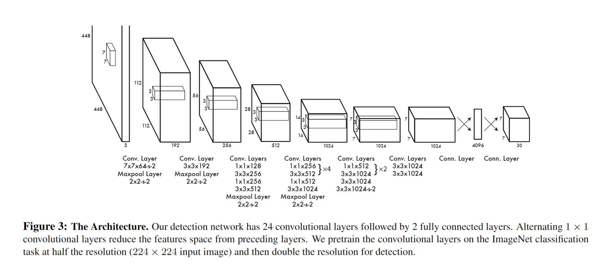

# 二、论文阅读

## 2.1 三步法读论文

第一遍：读标题和摘要，然后跳转到结论，可以同时看关键的图和表。约十几分钟。

第二遍：对整个文章过一遍，知道每一个部分在干什么。这时不需要过分追究证明或算法细节。可以圈出来不懂的地方。

第三遍：解决问题，包括证明和算法细节。这时可以结合第二遍的笔记，对不懂的地方进行补充。

## 2.2 YOLOv1

[You Only Look Once: Unified, Real-Time Object Detection](./yolo.pdf)

### Pass 1

**标题**：

- You Only Look Once: Unified, Real-Time Object Detection

所谓Unified，是指YOLO是一个统一的网络，可以直接从完整图像中预测边界框和类概率。

**摘要**：

我们提出了一种全新的物体检测方法 `YOLO`。 之前的物体检测工作是利用**分类器**来进行检测。而我们将物体检测作为一个**回归问题**，回归到空间上分离的边界框和相关的类别概率。在一次评估中，单个神经网络可直接从完整图像中预测边界框和类概率。由于整个检测管道是一个**单一的网络**，因此可以直接根据检测性能进行**端到端**的优化。

我们的统一架构速度极快。我们的基本 YOLO 模型以每秒 45 帧的速度实时处理图像。该网络的缩小版--Fast YOLO--处理速度达到惊人的每秒 155 帧，而 mAP 仍是其他实时检测器的两倍。与最先进的检测系统相比，YOLO 的定位错误更多，但在**背景上预测误报**的可能性较小。最后，YOLO 可以学习非常通用的物体表征。当从自然图像**泛化**到艺术品等其他领域时，它的表现优于其他检测方法，包括 DPM 和 R-CNN

从以上摘要中可以看出，YOLO的特点是：

1. **回归方法**：YOLO将目标检测视为回归问题，通过预测边界框的位置和相关类别的概率，实现目标的准确定位和分类。

2. **统一架构**：YOLO采用单一的神经网络，可以直接从完整图像中一次性预测出边界框和类别概率，实现端到端的优化，提高检测性能。

3. **高速实时处理**：YOLO的基础模型可以以每秒45帧的速度实时处理图像，而较小版本的Fast YOLO则以每秒155帧的速度处理图像，仍能保持较高的准确率。

4. **低背景误报**：相比其他实时检测器，YOLO在预测背景误报方面更少，减少了错误报告非目标物体的情况。

5. **通用目标表示**：YOLO能够学习到非常通用的目标表示，它在从自然图像到艺术品等其他领域的泛化任务中表现优秀。

Conclusion部分依旧重申了上述特点。

### Pass 2

#### Introduction

intro部分主要说YOLO是一种**实时目标检测系统**。与传统的检测方法相比，YOLO采用了全新的方法。它通过在**整个图像上**应用一个**单一的神经网络**，将图像分割成多个区域，并为每个区域预测边界框和概率。YOLO具有以下几个优点：

1. **非常快速**：YOLO的基本网络每秒能处理45帧图像，快速版本的处理速度超过150帧。这意味着可以实时处理流媒体视频，并且延迟少于25毫秒。此外，YOLO的平均精度比其他实时系统高出一倍以上。

2. **全局推理**：YOLO在进行预测时对整个图像进行全局推理。与**滑动窗口和基于区域建议**的方法不同，YOLO在训练和测试时都能看到整个图像，因此它隐含地编码了关于类别及其外观的上下文信息。相比之下，其他方法如Fast R-CNN在图像中将背景错误地识别为对象，因为它无法看到更大的上下文。与Fast R-CNN相比，YOLO的背景错误率减少了一半以上。

3. **学习通用表示**：YOLO能够学习到适用于不同对象的通用表示。在自然图像上训练并在艺术作品上进行测试时，YOLO的性能优于其他顶级检测方法，如DPM和R-CNN。由于YOLO具有很强的泛化能力，当应用于新领域或意外输入时，它不太容易出现故障。

#### Unified Detection

系统将输入图像划分为一个 S × S 的网格。**如果一个对象的中心落在一个网格单元中，该网格单元就负责检测该对象。**

每个网格单元预测 **B 个边界框**和相应的**置信度分数**。这些置信度分数反映了**模型对该边界框包含对象的自信程度**，以及它对自己的预测边界框的准确性的估计。形式上，我们定义置信度为 `Pr(Object) * IOUtruthpred`。

**如果该单元格中没有对象存在，则置信度分数应为零。否则，我们希望置信度分数等于预测边界框与实际边界框之间的交并比（IOU）**。

每个边界框由 5 个预测组成：`x、y、w、h 和置信度`。其中` (x, y)` 坐标表示边界框**相对于网格单元边界的中心位置**。宽度和高度**相对于整个图像进行预测**。最后的置信度预测表示**预测边界框**与任何**实际边界框**之间的`IOU`。

每个网格单元还预测 C 个**条件类别概率**，`Pr(Classi|Object)`。这些概率是基于网格单元中是否包含对象的条件的。无论边界框数量 B 如何，我们只为每个网格单元预测一组类别概率。

在测试时，我们将条件类别概率和单个边界框置信度预测相乘，

$$
Pr(Classi|Object) * Pr(Object) * IOU^{truth}_{pred} = Pr(Classi) * IOU^{truth}_{pred} 
$$

这为每个边界框给出了类别特定的**置信度分数**。这些分数既编码了该类别出现在边界框中的概率，也反映了预测边界框与对象的匹配程度。

#### Network Design

网络的初始**卷积层从图像中提取特征**，而**全连接层则预测输出的概率和坐标**。

我们的网络架构受到GoogLeNet图像分类模型的启发。我们的网络有24个卷积层，后面跟着2个全连接层。我们不使用GoogLeNet中的inception模块，而是简单地使用1×1的降维层，然后是3×3的卷积层

#### Train

最终层可预测类别概率和边界框坐标。我们根据图像的宽度和高度对边界框的**宽度和高度**进行**归一化处理**，使其介于 0 和 1 之间。我们将**边界框的 x 坐标和 y 坐标**参数化为特定网格单元位置的偏移量，使其也介于 0 和 1 之间。

在最后一层使用线性激活函数，所有其他层都使用leakyRELU激活函数。

我们对模型输出的**平方和误差**进行优化。我们使用平方总误差是因为它易于优化，但它与我们最大化平均精度的目标并不完全一致。它将定位误差与分类误差加权相等，这可能并不理想。此外，在每幅图像中，许多网格单元并不包含任何物体。**这使得这些单元格的 "可信度 "分数趋于零，往往会压倒包含物体的单元格的梯度**。这会导致模型的不稳定性，使训练在早期就出现偏离。

为了解决这个问题，我们增加了边界框坐标预测的**损失权重**，并减少了不包含物体的边界框信念预测的**损失权重**。我们使用两个参数 λcoord 和 λnoobj 来实现这一目标。我们设置 λcoord = 5 和 λnoobj = .5。

### Pass 3

#### 损失函数

训练的重要部分是损失函数。

YOLOv1的损失函数由两个部分组成：边界框损失和类别损失。

1. 边界框损失：

YOLOv1使用平方误差损失（Mean Squared Error，MSE）来度量预测边界框与真实边界框之间的差异。对于每个网格单元（grid cell），如果该网格单元负责检测到一个对象（object），则边界框损失为预测边界框和真实边界框之间的平方误差。如果该网格单元不负责检测到对象，则边界框损失为零。

边界框损失的计算公式如下：

$$
L_{\text{box}} = \sum_{i=0}^{S^2} \sum_{j=0}^{B} \mathbb{1}_{ij}^{obj} \left( (x_i - \hat{x}_i)^2 + (y_i - \hat{y}_i)^2 \right) \\+ \sum_{i=0}^{S^2} \sum_{j=0}^{B} \mathbb{1}_{ij}^{obj} \left( \sqrt{w_i} - \sqrt{\hat{w}_i} \right)^2 \\+ \sum_{i=0}^{S^2} \sum_{j=0}^{B} \mathbb{1}_{ij}^{obj} \left( \sqrt{h_i} - \sqrt{\hat{h}_i} \right)^2
$$

其中：
- S 是每行（列）网格单元的数量。
- B 是每个网格单元预测的边界框数量。
- $(x_i, y_i, w_i, h_i)$ 是第 i 个网格单元预测的边界框的坐标和尺寸。
- $(\hat{x}_i, \hat{y}_i, \hat{w}_i, \hat{h}_i)$ 是实际边界框的坐标和尺寸。
- $\mathbb{1}_{ij}^{obj}$ 是指示函数，如果第 i 个网格单元的第 j 个边界框**负责检测到对象**，则为 1，否则为 0。

2. 置信度损失：

YOLOv1使用二分类的交叉熵损失来度量预测边界框和真实边界框之间是否包含对象的置信度。对于每个网格单元的每个边界框，如果该边界框负责检测到一个对象，则置信度损失为预测置信度和真实置信度之间的交叉熵损失。如果该边界框不负责检测到对象，则置信度损失为预测置信度和零之间的交叉熵损失。

置信度损失的计算公式如下：
$$
L_{\text{conf}} = \sum_{i=0}^{S^2} \sum_{j=0}^{B} \mathbb{1}_{ij}^{obj} (\text{conf}_i - \hat{\text{conf}}_i)^2 + \lambda_{\text{noobj}} \sum_{i=0}^{S^2} \sum_{j=0}^{B} \mathbb{1}_{ij}^{noobj} (\text{conf}_i - \hat{\text{conf}}_i)^2
$$

其中：
- $\text{conf}_i$ 是第 i 个网格单元预测的置信度。
- $\hat{\text{conf}}_i$ 是真实置信度。
- $\mathbb{1}_{ij}^{obj}$ 是指示函数，如果第 i 个网格单元的第 j 个边界框负责检测到对象，则为 1，否则为 0。
- $\mathbb{1}_{ij}^{noobj}$ 是指示函数，如果第 i 个网格单元的第 j 个边界框不负责检测到对象，则为 1，否则为 0。
- $\lambda_{\text{noobj}}$ 是用于平衡负责检测对象和不负责检测对象的置信度损失的权重。

3. 类别损失：

YOLOv1使用交叉熵损失（Cross-Entropy Loss）来度量预测类别和真实类别之间的差异。对于每个网格单元，**如果该网格单元负责检测到一个对象**，则类别损失为预测类别和真实类别之间的**交叉熵损失**。如果该网格单元不负责检测到对象，则类别损失为**零**。

类别损失的计算公式如下：

$$
L_{\text{class}} = \sum_{i=0}^{S^2} \sum_{j=0}^{B} \mathbb{1}_{ij}^{obj} \sum_{c \in \text{classes}} (p_i(c) - \hat{p}_i(c))^2
$$

其中：
- $p_i(c)$ 是第 i 个网格单元预测的类别 c 的概率。
- $\hat{p}_i(c)$ 是真实类别 c 的概率。
- $\text{classes}$ 是所有类别的集合。

总损失函数包括边界框损失、类别损失和置信度损失的加权和：

$$
L = L_{\text{box}} + L_{\text{class}} + L_{\text{conf}}
$$

其中，各个损失项的权重可以通过调整来平衡它们的贡献。

#### 指示函数和置信度

在YOLOv1中，通过判断一个边界框与真实边界框的重叠程度来确定是否负责检测到对象。

1. 对于每个**真实对象**，首先确定其所属的网格单元。例如，如果图像被划分为 $S \times S$ 个网格单元，真实边界框的中心点坐标为 $(x, y)$，则其所属的网格单元索引为 $(\lfloor Sx \rfloor, \lfloor Sy \rfloor)$。

2. 对于每个网格单元，遍历其负责预测的所有边界框。对于每个边界框，计算其**与真实边界框的IoU值**。然后选取**Iou值最大的边界框**，作为负责检测到对象的边界框。其他则不负责。

`YOLOv1`假设**每个网格单元只负责检测一个对象**，因此在一个网格单元内可能有多个边界框。

## 2.2 YOLOv2/YOLO9000

[YOLO9000: Better, Faster, Stronger](./yolo9000.pdf)

### Pass 1

YOLO9000: Better, Faster, Stronger

摘要

摘要没说v2是如何改进模型的，只是吹了v2的性能有多好，提升的点有哪些。要点如下：

- **多尺度训练方法**：YOLOv2模型可以以不同的尺寸运行，提供了速度和准确性之间的简单折衷。

- **更好的表现**：YOLOv2在VOC 2007上以67 FPS的速度获得了76.8 mAP，在40 FPS时获得了78.6 mAP，超越了其他先进方法，如Faster R-CNN。

- **联合训练方法**：提出了一种联合训练目标检测和分类的方法，使用该方法在COCO和ImageNet数据集上同时训练YOLO9000。联合训练使YOLO9000能够预测未标注检测数据的目标类别，获得了在ImageNet检测验证集上的19.7 mAP和在COCO上的16.0 mAP。

- **预测种类和对象变多**：YOLO9000可以检测超过200个种类，预测超过9000个不同的目标类别的检测结果，并且仍然能够实时运行。

### Pass 2

#### introduction

主要是说：

1. 提出了一种新方法——通过利用我们已有的大量分类数据来扩大当前检测系统的范围。 我们的方法使用目标分类的分层视图，使得我们可以**将不同的数据集组合在一起**。

2. 提出了一种联合训练算法，它允许我们在检测和分类数据上训练目标检测器。 我们的方法利用标记检测图像来学习精确定位目标，同时使用分类图像来增加词汇量和鲁棒性

#### Better

重要部分，说明了YOLOv2的改进点。

改进点如下：

##### 1. Batch Normalization

在每个卷积层之后添加**批量标准化**，使得网络对超参数的选择更加鲁棒，加快收敛速度，提高准确率。批量标准化（batch normalization）可以显着改善收敛性，而且不再需要其他形式的正则化。map提升了2%。

##### 2. High Resolution Classifier

**高分辨率分类器**。这一部分是对 ImageNet **预训练模型**进行了改进，ImageNet 中图像大小是 224224，但是 YOLO 训练输入图像的尺寸是 448448。作者在这部分按照 448*448 的大小**重新训练了预训练网络**。map提升了4%。

##### 3. Convolutional With Anchor Boxes

重要，引入了锚框机制。

从YOLO中**移除全连接层**，并使用**锚框**来预测边界框。

首先我们消除一个池化层，以使网络卷积层的输出具有更高的分辨率。 我们还缩小网络，使其在分辨率为416X416的输入图像上运行，而不是448×448。我们这样做是因为我们**想要在特征图中有奇数个位置**，只有一个中心单元。目标，尤其是大的目标，往往占据图像的中心，所以最好在正中心拥有单独一个位置来预测这些目标，而不是在中心附近的四个位置。 YOLO的卷积层将图像下采样32倍，所以通过使用416的输入图像，我们得到13×13的输出特征图。

引入锚框后，我们将**类预测机制**与**空间位置**分开处理，单独预测每个锚框的类及其目标。遵循原来的YOLO的做法，目标预测依然预测了真实标签框（ground truth box）和候选框的IOU，而类别预测也是预测了当有目标存在时，该类别的条件概率。

##### 4. Dimension Clusters

聚类挑选。

确定 anchor 尺寸的时候，使用了 `k-means` 进行挑选，不是手动设定的。

使用每一类的平均宽度和高度，对所有的边界框进行聚类。聚类的目的是为了确定每一类的 anchor 的尺寸，聚类的方法是 k-means。在训练集的边界框上运行k-means，**自动找到良好的先验**。

##### 5. Direct location prediction

直接位置预测。有些难懂，第三遍再看。

这部分就体现出了 YOLOv2 中对 anchor 的使用是部分的。在 Faster-RCNN 或者 SSD 中，边界框的回归是相对于 anchor 而言的，但是在 YOLov2 中，**只有对于边界框长宽的回归**是相对于 anchor 的，但是对于位置（x，y）的预测还是基于 cell 的。

##### 6. Fine-Grained Features

细粒度特征。为了更好地预测小型物体。

修改后的YOLO在13×13特征图上预测检测结果。 虽然这对于**大型物体**是足够的，但使用更细粒度特征对定位较小物体有好处。

只需添加一个**直通层**，以26×26的分辨率**从较早的层中提取特征**。直通层将高分辨率特征与低分辨率特征连接起来，将**相邻特征叠加到不同的通道中**，而不是空间位置上，类似于ResNet中的恒等映射。

将26×26×512的特征图变为13×13×2048的特征图，然后就可以与原来的特征连接。检测器运行在这张扩展的特征图的顶部，以便它可以访问细粒度的功能。

##### 7. Multi-Scale Training

训练的时候，输入图像要是多尺度的。

不需要修改输入图像大小，而是**每隔几次迭代就改变一次网络**。

每10个批次我们的网络会随机选择一个新的图像尺寸大小。由于我们的模型缩减了32倍，所以我们从32的倍数中抽取：{320,352，…，608}。因此，最小的选项是320×320，最大的是608×608。我们调整网络的尺寸并继续训练。

#### Faster

为了最大限度地提高性能，我们从头开始设计YOLOv2。主要是提出了Darknet-19

与VGG模型类似，大多使用3×3滤波器，并且在池化层步骤后使用两倍的通道数。按照`Network in Network（NIN`）的方法，我们使用**全局平均池化**来做预测，并使用1×1滤波器来压缩3×3卷积的特征表示。我们使用批量归一化来稳定训练，加速收敛，并规范模型。

结构如下：

Darknet-19有19个卷积层和5个Maxpool层。 Darknet-19只需要55.8亿次操作来处理图像，但在ImageNet上实现了72.9％的top-1精度和91.2％的top-5精度。

#### Stronger

##### 联合训练分类和检测数据

提出了一个**联合训练分类和检测数据**的机制。 我们的方法使用了用于检测的图像来学习检测特定信息，如边界框坐标预测和目标以及如何对常见目标进行分类。**通过使用仅具有类标签的图像来扩展其可检测类别的数量**。

在训练期间，我们**混合来自检测和分类数据集的图像**。 当我们的网络看到标记为检测的图像时，可以根据完整的YOLOv2损失函数进行反向传播。 当它看到分类图像时，**只会反向传播分类部分的损失**。

##### 分层分类

在YOLOv2中，目标类别被组织成**一个层次结构**，其中包含多个级别的类别。每个级别代表一种抽象程度不同的类别。例如，在汽车这个高级类别下，可以有子类别如轿车、卡车、摩托车等。这种层次结构可以根据具体的数据集和任务进行设计和调整。

分层分类的关键思想是**将目标检测任务转化为一个多层级的分类问题**。在检测过程中，首先使用目标检测器（如YOLOv2）来定位和预测目标的边界框。然后，对于每个边界框，通过分层分类器来预测其所属的目标类别。

分层分类的优势在于它能够处理大量的目标类别，并提供**更细粒度**的分类结果。通过引入层次结构，模型可以更有效地共享和学习类别之间的相似性和关联性，从而提高分类的准确性。

### Pass 3

#### 锚框机制

锚框的生成是通过**聚类目标框**的方式进行的。

首先，使用K-means聚类算法对训练集中的目标框进行聚类，将它们划分为一些簇。然后，选择**每个簇的中心**作为锚框的**尺寸和宽高比**。这样可以得到一组锚框，涵盖了训练集中目标的不同大小和形状。

#### 直接位置预测

当在 YOLO 中使用**锚框**时，我们会遇到第二个问题：模型**不稳定**，尤其是在早期迭代的过程中。 

大多数不稳定来自于预测框的（x，y）位置。 在候选区域网络中，网络预测的 $t_x, t_y$  ，和中心坐标（x，y）计算如下：

$$
x = t_x * w_a - x_a
y = t_y * h_a - y_a
$$ 

例如，预测 $t_x = 1$ 会使该框向右移动锚框的宽度，而预测 $t_y = -1$ 会将其向左移动相同的量。

这个公式是**不受约束**的，所以任何锚框都可以在图像中的任何一点结束，而不管这个框是在哪个位置预测的。随机初始化模型需要很长时间才能稳定以预测合理的偏移。

网络为特征图的输出的每个单元预测5个边界框。网络预测每个边界框的5个坐标$t_x, t_y, t_w, t_h, t_o$。我们使用**sigmoid激活函数**来限制这些预测的范围。

如果单元格从图像的左上角偏移了$(c_x,x_y)$
 ,并且之前的边界框具有宽度和高度$(p_w, p_h)$ ，则预测对应于

为什么这么做？

**在巨人的肩膀上做回归**

使用sigmoid函数，映射到0到1，作为xy在grid cell里面的偏移。cx、cy是标注好的，不是网络输出。

使用e指数，映射到0到正无穷，作为wh的缩放比例。pw、ph预定好的锚框大小（聚类得到）。t为负时缩小。t为正时放大。

## 2.3 YOLOv3

[YOLOv3: An Incremental Improvement](./yolov3.pdf)

YOLOv3论文更像是一个随笔，所以我们直接看v3版本的变化，并且总结整个YOLO。

### 网络结构

255 = 3 * (4 + 1 + 80)

其中，4是4个坐标，1是置信度，80是COCO类别数。3是3个anchor box。

网络输出了三个尺度的feature map，分别是13x13x255，26x26x255，52x52x255。以实现不同粒度的检测。

13*13的分配大尺度的anchor box。
52*52的分配小尺度的anchor box。

concatenation就是摞起来的操作。

浅层比较接近像素底层细粒度的信息，深层比较接近语义信息。

### 损失函数
